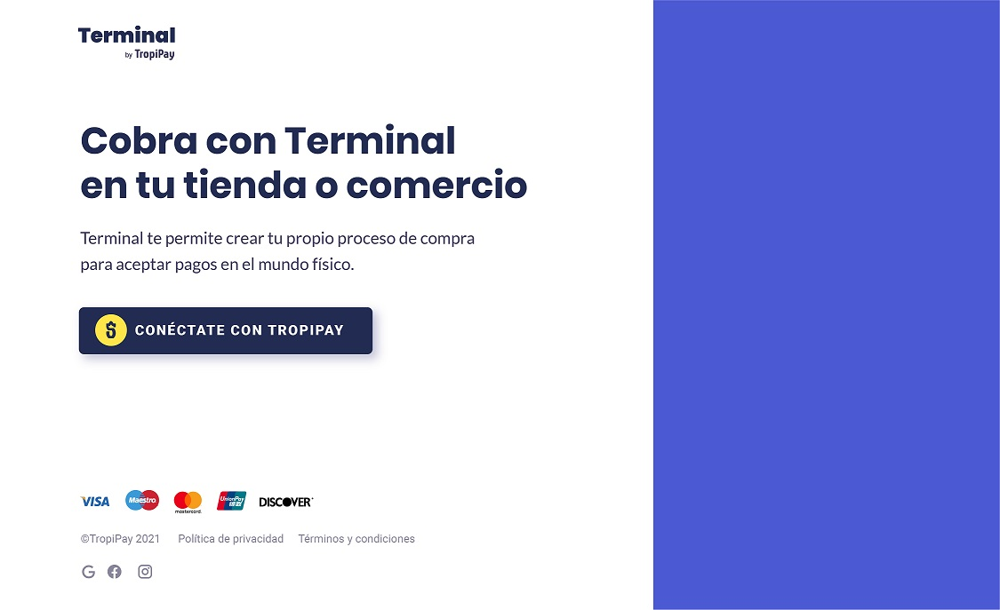

# TropiPay Terminal
The point of sale (POS) or point of purchase (POP) is the time and place where a retail transaction is completed. At the point of sale, the merchant calculates the amount owed by the customer, indicates that amount, may prepare an invoice for the customer (which may be a cash register printout), and indicates the options for the customer to make payment. It is also the point at which a customer makes a payment to the merchant in exchange for goods or after provision of a service. After receiving payment, the merchant may issue a receipt for the transaction, which is usually printed but can also be dispensed with or sent electronically.

### Demo 

Businesses are increasingly adopting POS systems, and one of the most obvious and compelling reasons is that a POS system does away with the need for price tags. Selling prices are linked to the product code of an item when adding stock, so the cashier merely needs to scan this code to process a sale. If there is a price change, this can also be easily done through the inventory window. Other advantages include the ability to implement various types of discounts, a loyalty scheme for customers, and more efficient stock control, and these features are typical of almost all modern ePOS systems.

### `Install`
- git clone https://github.com/tropipay/tropipay-terminal.git
- cd tropipay-terminal/
- npm install 
- cd client/
- npm install 

### `Run Option 1`
- npm start 
- cd client/
- npm start 

### `Run Option 2`
- npm run build 
- npm start 

### `Docker`
- docker-compose build
- docker-compose up -d 

### `Test`
Launches the test runner in the interactive watch mode.\
See the section about [running tests](https://facebook.github.io/create-react-app/docs/running-tests) for more information.
- npm run test

## Getting Started with Create React App

This project was bootstrapped with [Create React App](https://github.com/facebook/create-react-app).

### Available Scripts

In the project directory, you can run:

#### `yarn start`

Runs the app in the development mode.\
Open [http://localhost:3000](http://localhost:3000) to view it in the browser.

The page will reload if you make edits.\
You will also see any lint errors in the console.

#### `yarn build`

Builds the app for production to the `build` folder.\
It correctly bundles React in production mode and optimizes the build for the best performance.

The build is minified and the filenames include the hashes.\
Your app is ready to be deployed!

See the section about [deployment](https://facebook.github.io/create-react-app/docs/deployment) for more information.

#### `yarn eject`

**Note: this is a one-way operation. Once you `eject`, you can’t go back!**

If you aren’t satisfied with the build tool and configuration choices, you can `eject` at any time. This command will remove the single build dependency from your project.

Instead, it will copy all the configuration files and the transitive dependencies (webpack, Babel, ESLint, etc) right into your project so you have full control over them. All of the commands except `eject` will still work, but they will point to the copied scripts so you can tweak them. At this point you’re on your own.

You don’t have to ever use `eject`. The curated feature set is suitable for small and middle deployments, and you shouldn’t feel obligated to use this feature. However we understand that this tool wouldn’t be useful if you couldn’t customize it when you are ready for it.

### Learn More

You can learn more in the [Create React App documentation](https://facebook.github.io/create-react-app/docs/getting-started).

To learn React, check out the [React documentation](https://reactjs.org/).

#### Code Splitting

This section has moved here: [https://facebook.github.io/create-react-app/docs/code-splitting](https://facebook.github.io/create-react-app/docs/code-splitting)

#### Analyzing the Bundle Size

This section has moved here: [https://facebook.github.io/create-react-app/docs/analyzing-the-bundle-size](https://facebook.github.io/create-react-app/docs/analyzing-the-bundle-size)

#### Making a Progressive Web App

This section has moved here: [https://facebook.github.io/create-react-app/docs/making-a-progressive-web-app](https://facebook.github.io/create-react-app/docs/making-a-progressive-web-app)

#### Advanced Configuration

This section has moved here: [https://facebook.github.io/create-react-app/docs/advanced-configuration](https://facebook.github.io/create-react-app/docs/advanced-configuration)

#### Deployment

This section has moved here: [https://facebook.github.io/create-react-app/docs/deployment](https://facebook.github.io/create-react-app/docs/deployment)

#### `yarn build` fails to minify

This section has moved here: [https://facebook.github.io/create-react-app/docs/troubleshooting#npm-run-build-fails-to-minify](https://facebook.github.io/create-react-app/docs/troubleshooting#npm-run-build-fails-to-minify)
